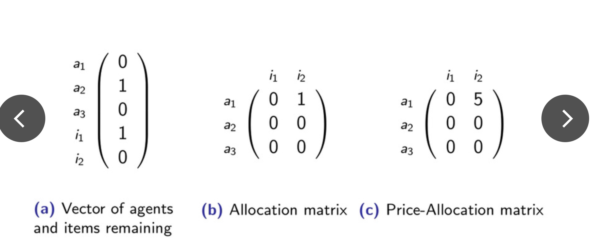

# Reinforcement-Learning-of-Sequential-Price-Mechanisms

论文Reinforcement Learning of Sequential Price Mechanisms的非官方复现

papar *Reinforcement Learning of Sequential Price Mechanisms* unofficial implementation

原文论文：

[Brero G, Eden A, Gerstgrasser M, et al. Reinforcement learning of sequential price mechanisms[C]//Proceedings of the AAAI Conference on Artificial Intelligence. 2021, 35(6): 5219-5227.](https://www.aaai.org/AAAI21Papers/AAAI-8029.BreroG.pdf)


## Sequential-Price-Mechanisms


- Agents :  $[n]=\{1, \ldots, n\}$

- Items : $[m]=\{1, \ldots, m\}$

- valuation function : $v_{i}: 2^{[m]} \rightarrow \mathbb{R}_{\geq 0}$

- Payment : $\boldsymbol{\tau}=\left(\tau_{1}, \ldots, \tau_{n}\right)$

- allocations : $\mathbf{x}=\left(x_{1}, \ldots, x_{n}\right)$

- social welfare : $\operatorname{sw}(\mathbf{x}, \mathbf{v})=\sum_{i \in[n]} v_{i}\left(x_{i}\right)$

  **Objective: maximize the expected social welfare**
  $$
  $\mathbb{E}_{\mathbf{v} \sim \mathcal{D},(\mathbf{x}, \boldsymbol{\tau}):=\mathcal{M}(\mathbf{v})}[\mathbf{S W}(\mathbf{x}, \mathbf{v})]$
  $$
  

Initialize : $\rho^{0}=\left(\rho_{\text {agents }}^{0}, \rho_{\text {items }}^{0}\right) = ([n],[m])$, $\mathbf{x}^{0}=(\emptyset, \ldots, \emptyset)$ and $\boldsymbol{\tau}^{0}=(0, \ldots, 0)$.

one mechanism step(round):

1. the mechanism picks an agent $i^{t} \in \rho_{\text {agents }}^{t-1}$ and posts a price $p_{j}^{t}$ for each available item $j \in \rho_{\text {items }}^{t-1}$.
2. agent $i^t$ selects a bundle $x^t$ and is charged payment $\sum_{j \in x^{t}} p_{j}^{t}$.
3. the mechanism update the remaining items $\rho_{\text {items }}^{t}$, remaining agents $\rho_{\text {agents}}^{t}$, temporary allocation $x^t$, and temporary payment profile $\tau^t$.
4. The game terminates when no agents or items are left.

## Learning Optimal SPMs


The problem of designing an optimal SPM is casted as a POMDP problem.

- *state* : $s^{t}=\left(\mathbf{v}, \mathbf{x}^{t-1}, \rho^{t-1}\right)$
- *action* : $a^{t}=\left(i^{t}, p^{t}\right)$
- *observation* : $o^{t+1}=\left(i^{t}, p^{t}, x^{t}\right) \in \mathcal{O}$
- *reward* = $\operatorname{sw}\left(\mathbf{x}^{t}, \mathbf{v}\right)$ if terminal state else 0

3 different types statistic of the history as **observations**:



  (a). Items/agents left: encoding which items are still available and which agents are still to be considered.

  (b). Allocation matrix: **in addition to items/agents left**, encodes the temporary allocation x tat each round t. 

  (c). Price-allocation matrix: i**n addition to items/agents left and temporary allocation**, stores an n × m real-valued matrix with the prices the agents have faced so far. 


## Expiremnts

We first test a setting with 5 multiple identical copies of an item, and 20 agents with unit-demand and correlated values. 

For this, we use parameter $0\leq \delta\leq 1$ to control the amount of correlation. 

We sample $z \sim U\left[\frac{1-\delta}{2}, \frac{1+\delta}{2}\right]$, and draw $v_{i}$ independently from unif$\left(z-\frac{1-\delta}{2}, z+\frac{1-\delta}{2}\right)$.

- Delta = 0

  ```python
  self.valuationF = np.array([[0.78900805,0.96012449,0.99099806,0.58527462,0.63666145],\
                          [0.98648185,0.55739215,0.19698906,0.68369219,0.27437320],\
                          [0.86374709,0.85091796,0.43573782,0.13482168,0.40099636],\
                          [0.58141219,0.22629741,0.66612841,0.97642836,0.79005999],\
                          [0.30114841,0.11199923,0.01076650,0.66018063,0.51939904],\
                          [0.83135732,0.50467929,0.34803428,0.23014417,0.93165713],\
                          [0.90753162,0.45139716,0.12398481,0.87917376,0.95310834],\
                          [0.15536485,0.47051726,0.36178991,0.84614371,0.27937186],\
                          [0.46667823,0.16453699,0.61319562,0.41454692,0.11260570],\
                          [0.89602795,0.06285511,0.93314658,0.97294757,0.86253819],\
                          [0.35162777,0.27674798,0.92889346,0.25404701,0.06598934],\
                          [0.20304112,0.12649533,0.10892991,0.84067924,0.33471859],\
                          [0.41421655,0.78001907,0.19546347,0.03083713,0.24251268],\
                          [0.83174977,0.05870072,0.54456963,0.35504824,0.57398383],\
                          [0.04114803,0.28719724,0.76151723,0.68865910,0.15022888],\
                          [0.39452686,0.16493265,0.86196355,0.13994046,0.35771739],\
                          [0.90833496,0.83428713,0.75482767,0.29083134,0.06442374],\
                          [0.33674271,0.28909863,0.67971812,0.01846276,0.81958546],\
                          [0.49674642,0.72062413,0.07787972,0.24753036,0.55676578],\
                        [0.73727425,0.13167262,0.73926587,0.41809112,0.55647347]],dtype=np.float32)
  ```

- Delta = 0.34

  ```python
  self.valuationF=np.array([[0.28746766,0.11773536,0.06417870,0.21074364,0.47814521],\
                          [0.52800661,0.19562626,0.24214131,0.63061773,0.58011432],\
                          [0.25686938,0.27776415,0.07730791,0.40525655,0.43227341],\
                          [0.60449626,0.36269815,0.21132956,0.47090524,0.40805888],\
                          [0.31917121,0.17862318,0.22754560,0.36751298,0.19221779],\
                          [0.19203603,0.24428465,0.16879044,0.36700307,0.08487778],\
                          [0.59771820,0.26470922,0.52927054,0.41799680,0.20547174],\
                          [0.38280490,0.47394948,0.17736245,0.63987204,0.45280828],\
                          [0.22674475,0.17646293,0.20397242,0.67082954,0.05140794],\
                          [0.45652455,0.50693406,0.59523298,0.07084946,0.13145058],\
                          [0.43195991,0.05722680,0.31895462,0.32064159,0.33700103],\
                          [0.66470028,0.33526021,0.60525721,0.69022206,0.56940958],\
                          [0.04651746,0.20159853,0.70205233,0.09177878,0.63128829],\
                          [0.52686478,0.40227233,0.36102621,0.67907867,0.37154088],\
                          [0.20104286,0.33263745,0.55911495,0.48018483,0.16943506],\
                          [0.62039231,0.41561842,0.09501664,0.16722161,0.57961700],\
                          [0.69621466,0.37048358,0.38992990,0.65110436,0.66278520],\
                          [0.31267322,0.66777534,0.15991525,0.37678061,0.68928265],\
                          [0.61405565,0.07927069,0.37009645,0.28577439,0.63793179],\
                          [0.54774761,0.36121875,0.46010207,0.22939186,0.46555167]],dtype=np.float32)
  ```

- Delta = 0.5

  ```python 
  self.valuationF=np.array([[0.28746766,0.11773536,0.06417870,0.21074364,0.47814521],\
                          [0.52800661,0.19562626,0.24214131,0.63061773,0.58011432],\
                          [0.25686938,0.27776415,0.07730791,0.40525655,0.43227341],\
                          [0.60449626,0.36269815,0.21132956,0.47090524,0.40805888],\
                          [0.31917121,0.17862318,0.22754560,0.36751298,0.19221779],\
                          [0.19203603,0.24428465,0.16879044,0.36700307,0.08487778],\
                          [0.59771820,0.26470922,0.52927054,0.41799680,0.20547174],\
                          [0.38280490,0.47394948,0.17736245,0.63987204,0.45280828],\
                          [0.22674475,0.17646293,0.20397242,0.67082954,0.05140794],\
                          [0.45652455,0.50693406,0.59523298,0.07084946,0.13145058],\
                          [0.43195991,0.05722680,0.31895462,0.32064159,0.33700103],\
                          [0.66470028,0.33526021,0.60525721,0.69022206,0.56940958],\
                          [0.04651746,0.20159853,0.70205233,0.09177878,0.63128829],\
                          [0.52686478,0.40227233,0.36102621,0.67907867,0.37154088],\
                          [0.20104286,0.33263745,0.55911495,0.48018483,0.16943506],\
                          [0.62039231,0.41561842,0.09501664,0.16722161,0.57961700],\
                          [0.69621466,0.37048358,0.38992990,0.65110436,0.66278520],\
                          [0.31267322,0.66777534,0.15991525,0.37678061,0.68928265],\
                          [0.61405565,0.07927069,0.37009645,0.28577439,0.63793179],\
                          [0.54774761,0.36121875,0.46010207,0.22939186,0.46555167]],dtype=np.float32)
  ```

 using Stable_baseline3 lib

### maximize social welfare


The following experiments are for the agent to select only one item, which has been corrected in the latest code. 


### maximize payment

